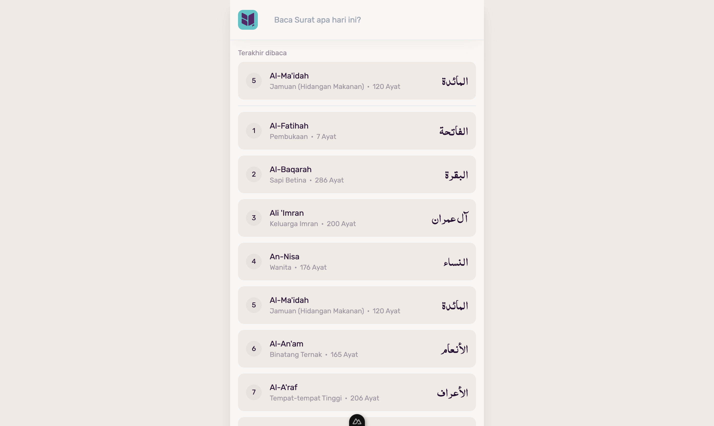
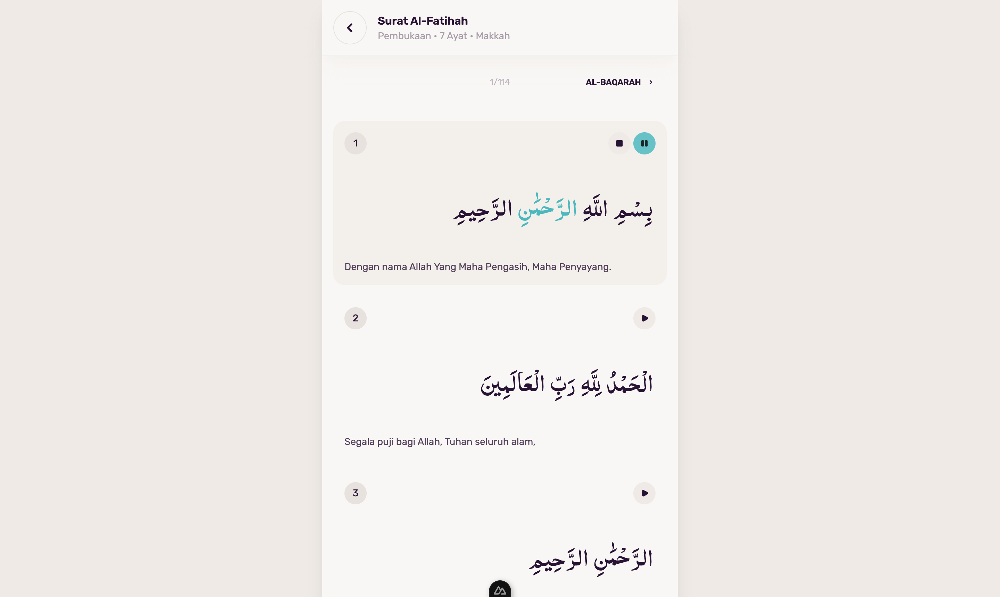

<br/>
<p align="center">
  <a href="https://github.com/ichsanmln99/baca-alquran-v2">
    
  </a>

  <h3 align="center">baca-alquran.com</h3>

  <p align="center">
    Aplikasi Baca Alquran Online dengan Audio dan Terjemah Bahasa Indonesia
  </p>
</p>


## Screenshots




## Live Website

<https://www.baca-alquran.com/>

## Installation

```sh

git clone https://github.com/ichsanmln99/baca-alquran-v2.git

cd baca-alquran-v2

npm install

# development
npm run dev

# production
npm run build

# preview
npm run preview

```

Development akan berjalan pada `http://localhost:3000`

## Credits

- Quran API from [Quran.com API](https://quran.com/en/developers)
- Icon from [Nuxt Icon](https://nuxt.com/modules/icon)
